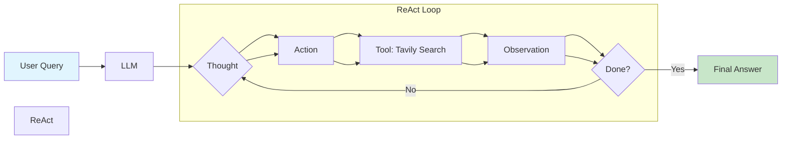

# ReAct Search Agent

A ReAct (Reasoning + Acting) agent built with LangGraph and LangChain that uses web search to answer questions with real-time information.

## What is ReAct?

ReAct is an agent architecture that combines **reasoning** (thinking about what to do) with **acting** (executing tools). The agent follows a loop:

```
Question → Thought → Action → Observation → ... → Final Answer
```

## Architecture



## Features

- **LangGraph ReAct Agent**: Uses `create_react_agent` from LangGraph for robust agent execution
- **Tavily Search Integration**: Real-time web search capabilities
- **OpenAI GPT-4o-mini**: Fast and cost-effective language model
- **Debug Mode**: Trace all messages in the agent conversation flow

## Prerequisites

- Python 3.12+
- OpenAI API key
- Tavily API key

## Installation

1. **Clone the repository**
   ```bash
   git clone https://github.com/Kedarnadhsharma/search-react-agent.git
   cd search-react-agent
   ```

2. **Install dependencies using uv**
   ```bash
   uv sync
   ```

3. **Set up environment variables**
   
   Create a `.env` file in the project root:
   ```env
   OPENAI_API_KEY=your-openai-api-key
   TAVILY_API_KEY=your-tavily-api-key
   ```

   Get your API keys from:
   - OpenAI: https://platform.openai.com/api-keys
   - Tavily: https://tavily.com

## Usage

Run the agent:
```bash
uv run python main.py
```

### Example Query

The agent can answer questions that require real-time information:

```python
result = agent.invoke(
    {"messages": [{"role": "user", "content": "What is the weather in Tokyo?"}]}
)
```

## Project Structure

| File | Purpose |
|------|---------|
| `main.py` | Main agent implementation with debug output |
| `schemas.py` | Pydantic models for structured output |
| `prompt.py` | Custom prompt templates |
| `pyproject.toml` | Project dependencies |
| `.env` | Environment variables (not committed) |

## How It Works

1. **User Query**: The user asks a question
2. **Agent Reasoning**: The LLM decides if it needs to use a tool
3. **Tool Execution**: If needed, the agent calls Tavily Search
4. **Observation**: The agent receives search results
5. **Final Answer**: The agent synthesizes information into a response

### Debug Output

The agent includes debug output to trace the conversation flow:

```
=== DEBUG: All messages ===

--- Message 0 (HumanMessage) ---
Content: What is weather in Tokyo?

--- Message 1 (AIMessage) ---
Content: 
Tool calls: [{'name': 'tavily_search', 'args': {'query': 'current weather Tokyo'}, ...}]

--- Message 2 (ToolMessage) ---
Content: [search results...]

--- Message 3 (AIMessage) ---
Content: The current weather in Tokyo is...

=== FINAL ANSWER ===
The current weather in Tokyo is...
```

## Dependencies

- `langchain` - LLM application framework
- `langchain-openai` - OpenAI integration
- `langchain-tavily` - Tavily search integration
- `langgraph` - Graph-based agent orchestration
- `python-dotenv` - Environment variable management

## Troubleshooting

### Error: 401 Unauthorized (Tavily)
Your Tavily API key is invalid or expired. Get a new key from https://tavily.com

### Error: 429 Rate Limit (OpenAI)
You've hit OpenAI's rate limits. Wait a few minutes or switch to a different model.

### Deprecation Warning
The warning about `create_react_agent` being moved is informational only and doesn't affect functionality.

## License

MIT
